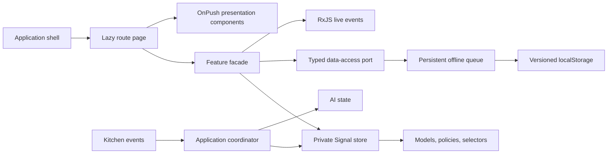

# Sahm Food Smart Restaurant POS

Sahm Food is a browser-based restaurant operations workspace for Egyptian branches. It brings live orders, AI recommendations, kitchen load, product discovery, and resilient offline synchronization into one responsive Angular 22 application. Prices use EGP, and deterministic demo data uses Egyptian customers, locations, and menu items.

## Setup

Use Node `24.15.0` (see `.nvmrc`) and npm `11.11.0`, then run:

```bash
npm install
npm start
```

The application is available at `http://localhost:4200` and redirects to `/orders`.

## Commands

```bash
npm start                  # Development server
npm run typecheck          # Strict TypeScript check
npm run lint               # TypeScript and Angular template linting
npm test -- --watch=false  # Vitest suite once
npm run build              # Production build
npm run format:check       # Formatting verification
```

## Architecture



Feature folders separate `domain`, `data-access`, `state`, `ui`, and `pages`. Writable Signals remain private to focused feature stores. Pages compose readonly view state, while presentation components communicate through typed inputs and outputs.

### Folder structure

```text
src/app/
├── core/                 # Shell, connectivity, persistence, logging, notifications
├── shared/               # Shared types, utilities, dialogs, and reusable UI
└── features/
    ├── orders/           # Live order domain, state, data access, page, and UI
    ├── ai-assistant/     # Streaming recommendation state and simulator
    ├── kitchen/          # Load policies, live events, monitor, and history
    ├── products/         # Dataset, search state, persistence, and combobox UI
    ├── offline-queue/    # Operations, processor, persistence, and recovery UI
    └── simulation/       # Development-only command panel and coordinators
```

Signals own synchronous feature state and computed view models: filters, counters, summaries, selected entities, and render-ready result lists. Writable Signals stay inside stores or facades. RxJS owns time, cancellation, and orchestration: debounced search, streamed AI chunks, live order/kitchen events, queue processing, retries, and teardown. Components do not execute business policies or own streaming subscriptions.

## Live Orders

The Live Orders route loads 56 deterministic, realistic orders across walk-in, delivery, and online channels. Pure selectors handle status, channel, priority, search, and sort criteria outside templates. A typed RxJS event source periodically adds orders and changes status, priority, delay, and payment information.

Status rules live in a pure domain policy. User status changes are applied optimistically, marked pending, and sent through a typed repository command with an idempotency key. Success confirms the revision; simulated failure rolls back the previous status and emits a user notification. Repeated commands are suppressed while synchronization is pending. The repository boundary is ready for the persistent offline queue planned for a later stage.

## AI Order Assistant

The selected order drawer includes a typed AI assistant with idle, loading, streaming, success, empty, error, and cancelled states. A dedicated RxJS simulator emits metadata and timed content chunks and supports deterministic success, failure, empty, and slow-stream scenarios. The feature facade owns cancellation, retries, race protection, and stale-result detection; presentation components only render state and emit user actions. Changing the selected order unsubscribes the previous stream so stale responses cannot overwrite the new order.

Development controls inside the panel can force the next outcome, slow streaming, or reset recommendation state without changing production-facing domain rules.

## Kitchen Load Monitor

The Kitchen route exposes live overall load, active and delayed order counts, preparation-time estimates, station capacity, and a bounded workload history. Five typed stations—Grill, Fryer, Drinks, Desserts, and Packaging—update through a deterministic RxJS event simulator. The history chart uses semantic HTML and CSS with an assistive-text equivalent instead of a charting dependency.

A typed application coordinator listens for kitchen load events while the Orders workspace is active. Pure order policies calculate delays, priority changes, and revised preparation estimates; the coordinator updates order state and invalidates an existing AI recommendation without kitchen services referencing order or AI components. Development-only controls can increase/decrease load, select Normal/Busy/Critical conditions, and reset history.

## Advanced Product Search

The Product Search route loads 720 deterministic Egyptian menu products with EGP prices, availability, preparation time, dietary tags, allergens, popularity, and lightweight icons. Input state updates immediately while an RxJS pipeline debounces expensive search application by 180ms. Pure selectors combine name, category, and availability criteria, rank matches, and cap rendering at 60 products without requiring virtual scrolling.

The search uses accessible combobox/listbox semantics with active-descendant tracking and complete Arrow Up, Arrow Down, Enter, and Escape behavior. Matching text is split into safe text segments and rendered without HTML injection. Recent non-empty searches are deduplicated, capped at six, and persisted through the shared persistence abstraction.

## Offline Queue and Synchronization

The shell and Offline Queue route expose Online, Offline, and Unstable connectivity simulation in development. Order status changes remain optimistic outside stable Online mode and are stored as versioned, typed queue operations containing unique IDs, deterministic idempotency keys, typed payloads, timestamps, retry state, and user-safe errors. A validated localStorage adapter restores operations after refresh and recovers interrupted `processing` entries as `pending`.

One root processor uses `exhaustMap` to prevent concurrent drains and `concatMap` to preserve FIFO execution. Transient failures receive bounded exponential retries; permanent failures stop and remain visible for manual retry or removal. Reconnection triggers synchronization automatically. Completed or permanently failed results reconcile the active order store, while restored queue history reapplies pending, confirmed, or failed status state after a page refresh.

## Current scope

The application shell, Live Orders workspace, AI Order Assistant, Kitchen Load Monitor, Product Search, and persistent Offline Queue are functional.

## Development simulation panel

Development builds include a clearly labelled panel that can add an order, update order status or payment, change kitchen load, force the next AI outcome, switch connectivity, request synchronization, and reset mock state. A typed command bus and application coordinators isolate these controls from production-facing domain logic. The panel is omitted from production builds through Angular's development-mode guard.

## Persistence and offline design

The queue uses a versioned, validated localStorage adapter. It was selected over IndexedDB because operations are small command records and require no indexed queries. Storage access remains behind a typed abstraction, so a future adapter can replace it without changing components or domain rules. Invalid or unreadable records become safe application errors. One processor preserves FIFO order, prevents concurrent drains, applies bounded retry, and restores pending work after refresh.

## Performance decisions

- All components use `OnPush`, immutable updates, stable identity tracking, and computed view models.
- Product input is debounced before filtering 720 records, and rendering is capped at 60 results.
- Orders are filtered and sorted in feature selectors rather than templates.
- Kitchen history is bounded and rendered with semantic HTML/CSS instead of a chart dependency.
- Live streams use lifecycle teardown and never place polling subscriptions in components.

## Accessibility decisions

The shell includes a skip link, semantic landmarks, labelled icon-only controls, tooltips for collapsed navigation, visible focus styles, and text equivalents for status indicators. Product search follows combobox/listbox and active-descendant keyboard semantics. Order details and confirmation dialogs move focus inside, trap Tab navigation, close with Escape, and restore the triggering focus. Toasts, AI streaming, connectivity, and search counts expose live status text. Status meaning is not color-only, and reduced-motion preferences disable non-essential transitions.

## Testing

Vitest covers domain policies, selectors, optimistic success and rollback, AI streaming/cancellation/race protection, kitchen coordination, product search and keyboard behavior, persistence validation, queue ordering/retries/deduplication/reconnection, and simulation-command routing.

```bash
npm test -- --watch=false
```

## Trade-offs and known limitations

- This is a front-end simulation; authentication, server APIs, and multi-device conflict resolution are outside the current scope.
- localStorage has synchronous I/O and quota limits; high-volume production use should adopt IndexedDB or a service-worker-backed store.
- Live and AI results are simulations, not production telemetry or a hosted AI model.
- Product rendering is capped rather than virtualized because Angular CDK is not installed and the cap keeps typing responsive.
- Currency and sample data are Egyptian/EGP, while interface copy is currently English only.
