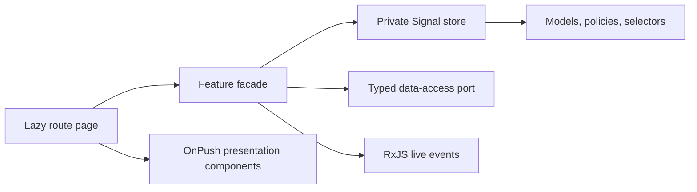

# Sahm Food Smart Order Workspace

Browser-based restaurant POS prototype built with Angular 22, standalone components, strict TypeScript, Signals, RxJS, SCSS, ESLint, Prettier, and Vitest.

## Setup

Use Node `24.15.0` (see `.nvmrc`), then run:

```bash
npm install
npm start
```

The application is available at `http://localhost:4200` and redirects to `/orders`.

## Commands

```bash
npm start                  # Development server
npm run typecheck          # Strict TypeScript check
npm run lint               # TypeScript and Angular template linting
npm test -- --watch=false  # Vitest suite once
npm run build              # Production build
npm run format:check       # Formatting verification
```

## Architecture



Feature folders separate `domain`, `data-access`, `state`, `ui`, and `pages`. Writable Signals remain private to focused feature stores. Pages compose readonly view state, while presentation components communicate through typed inputs and outputs.

## Live Orders

The Live Orders route loads 56 deterministic, realistic orders across walk-in, delivery, and online channels. Pure selectors handle status, channel, priority, search, and sort criteria outside templates. A typed RxJS event source periodically adds orders and changes status, priority, delay, and payment information.

Status rules live in a pure domain policy. User status changes are applied optimistically, marked pending, and sent through a typed repository command with an idempotency key. Success confirms the revision; simulated failure rolls back the previous status and emits a user notification. Repeated commands are suppressed while synchronization is pending. The repository boundary is ready for the persistent offline queue planned for a later stage.

## AI Order Assistant

The selected order drawer includes a typed AI assistant with idle, loading, streaming, success, empty, error, and cancelled states. A dedicated RxJS simulator emits metadata and timed content chunks and supports deterministic success, failure, empty, and slow-stream scenarios. The feature facade owns cancellation, retries, race protection, and stale-result detection; presentation components only render state and emit user actions. Changing the selected order unsubscribes the previous stream so stale responses cannot overwrite the new order.

Development controls inside the panel can force the next outcome, slow streaming, or reset recommendation state without changing production-facing domain rules.

## Kitchen Load Monitor

The Kitchen route exposes live overall load, active and delayed order counts, preparation-time estimates, station capacity, and a bounded workload history. Five typed stations—Grill, Fryer, Drinks, Desserts, and Packaging—update through a deterministic RxJS event simulator. The history chart uses semantic HTML and CSS with an assistive-text equivalent instead of a charting dependency.

A typed application coordinator listens for kitchen load events while the Orders workspace is active. Pure order policies calculate delays, priority changes, and revised preparation estimates; the coordinator updates order state and invalidates an existing AI recommendation without kitchen services referencing order or AI components. Development-only controls can increase/decrease load, select Normal/Busy/Critical conditions, and reset history.

## Current scope

The application shell, Live Orders workspace, AI Order Assistant, and Kitchen Load Monitor are functional. Product search and persistent offline synchronization remain staged behind their existing lazy route and architecture boundaries.
